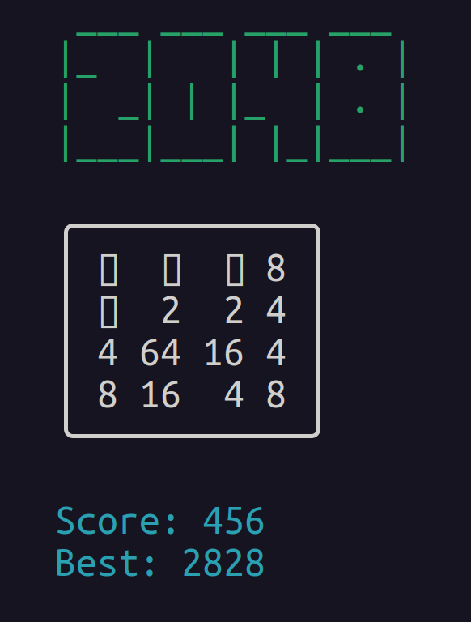

# 2048

Based on the original 2048 by Gabriele Cirulli.



## How to play

- Use your arrow keys to move the tiles.
- Tiles with the same number merge into one when they touch.
- Add them up to reach 2048!

## Usage

To play the game, run the following command in your terminal:

```bash
python3 g2048.py
```
